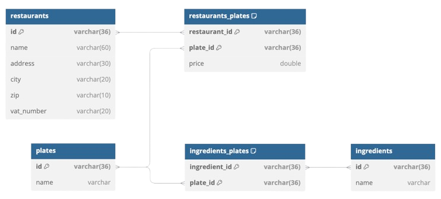

# Restaurant menu

Training project that will handle restaurants menu.
In this project will be possible to perform all the CRUD operations directly to the entities Restaurants, Plates and Ingredients.  

Moreover, it will be possible to:
- GET a restaurant menu
- GET all the ingredients used by a restaurant

## Entity Relationship Model

